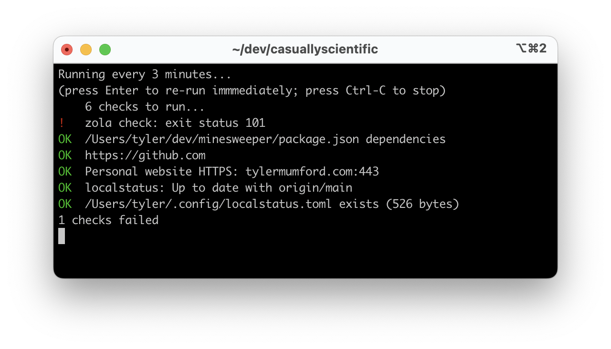

# LocalStatus

[Docs here](./docs/all.md)

Automatically monitors the important parts of your local development environment. Not in a fancy way.
Just in a fifteen-year-old-Honda-Civic kind of way.

* Ping your local services
* Verify needed files exist
* Keep an eye on Git repos
* and more

This is a work in progress. I use it, but I'd definitely still call it a beta.
I'm hoping for thoughtful feedback and,
of course, GitHub stars. 😅 External validation for the win!

## Example

After you create `~/.config/localstatus.toml` and define your checks,
you can run `localstatus` to perform them.
With no arguments, it runs them all once:

```
/Users/tyler/dev/localstatus: localstatus
    6 checks to run...
!   zola check: exit status 101
OK  /Users/tyler/dev/minesweeper/package.json dependencies
OK  https://github.com
OK  Personal website HTTPS: tylermumford.com:443
OK  localstatus: Up to date with origin/main
OK  /Users/tyler/.config/localstatus.toml exists (526 bytes)
1 checks failed
```

Or, with the `--watch` flag, it keeps going.
I like to keep a terminal window open all day to keep an eye on everything.



## Configuring the checks

LocalStatus is configured with the [TOML format].
TOML is widely supported and has nice features,
like comments and flexible string literals.

[TOML format]: https://toml.io/en/

Right now, LocalStatus only looks for configuration at the hard-coded path of
`~/.config/localstatus.toml`.
This will change and become more flexible in the future.

All of the available [checks are documented here](./docs/all.md).

The config looks like this:

```toml
# ~/.config/localstatus.toml
checks = [
    {check = "command", program = "zola", args = ["check"]},
    {check = "npm.install", package = "/Users/tyler/dev/minesweeper/package.json"},
    {check = "http.ok", url = "https://github.com"},
    {check = "tcp.open", address = "tylermumford.com:443", label = "Personal website HTTPS"},
    {check = "git.branch", dir = "/Users/tyler/dev/localstatus", base = "origin/main"},
    {check = "file.exists", path = "/Users/tyler/.config/localstatus.toml"}
]
```

The snippet above is using TOML's inline table syntax to reduce the number of lines.
The following snippet uses TOML's "array of tables" syntax to have shorter lines.
Both snippets are equivalent.

```toml
[[checks]]
check = "command"
program = "zola"
args = ["check"]
dir  = "/Users/tyler/dev/tylermumford.github.io"

[[checks]]
check = "npm.install"
package = "/Users/tyler/dev/minesweeper/package.json"

[[checks]]
check = "http.ok"
url = "https://github.com"

[[checks]]
check = "tcp.open"
address = "tylermumford.com:443"
label = "Personal website HTTPS"

[[checks]]
check = "git.branch"
dir = "/Users/tyler/dev/localstatus"
base = "origin/main"

[[checks]]
check = "file.exists"
path = "/Users/tyler/.config/localstatus.toml"
```

## Installing

`brew install tylermumford/brew/localstatus`

Or, download the source and run `go install`

([Scoop] support will be added, too, but it's not ready yet.)

[Scoop]: https://scoop.sh

## Motivation / Rant

😵‍💫

At work, my local development environment needs to be _just so._ I need to remember to connect to
the VPN, run the cloud storage emulator, and check the local status pages of about twelve
services in case one of them has a problem. I need to make sure my repositories aren't falling too
far behind my team, my database has the latest migrations, and I've run `npm install` since the
last update to `package.json`. And there are local files that need to exist even though they aren't
checked in to source control.

That's a lot of moving pieces, so of course, I created a tool to check them all for me.

Also, I'm just saddened by the trend I've been seeing with more and more systems only being runnable
in the cloud. If your system doesn't work locally, then you can't do anything when your Internet
goes down, or your cloud provider goes down, or your IT department can't get you access to something
right away. In other words, local development is a "cause" I believe in.

## Relevant projects

If you think LocalStatus is interesting,
you might also like these projects:

* [Just] command runner
* [Uptime Kuma] self-hosted uptime monitoring
* [Earthly] opinionated build automation

[Just]: https://github.com/casey/just
[Uptime Kuma]: https://github.com/louislam/uptime-kuma
[Earthly]: https://github.com/earthly/earthly

## Disclosure

I'm creating this project because I think it needs to exist. I use something similar at work already.
But I'm also planning to create some paid macOS and Windows companion apps that will integrate with
LocalStatus. Those will most likely be closed source. I don't want to sell the project. My hope is
to create something of value that can earn some money.

This is my first open source project that I actually hope lots of people will use. But again, it's
my first, so please bear with me as I figure this out. 💛

## Trivia

- This project was almost named Brock, because GitHub generated a repo name of "friendly-broccoli."
- This project was almost named Checkmate, generated by ChatGPT.
- This project was almost named ldca, for Local Development is Cool Again.
- This project was almost named Local Host Checker, for the cool acronym LHC.
